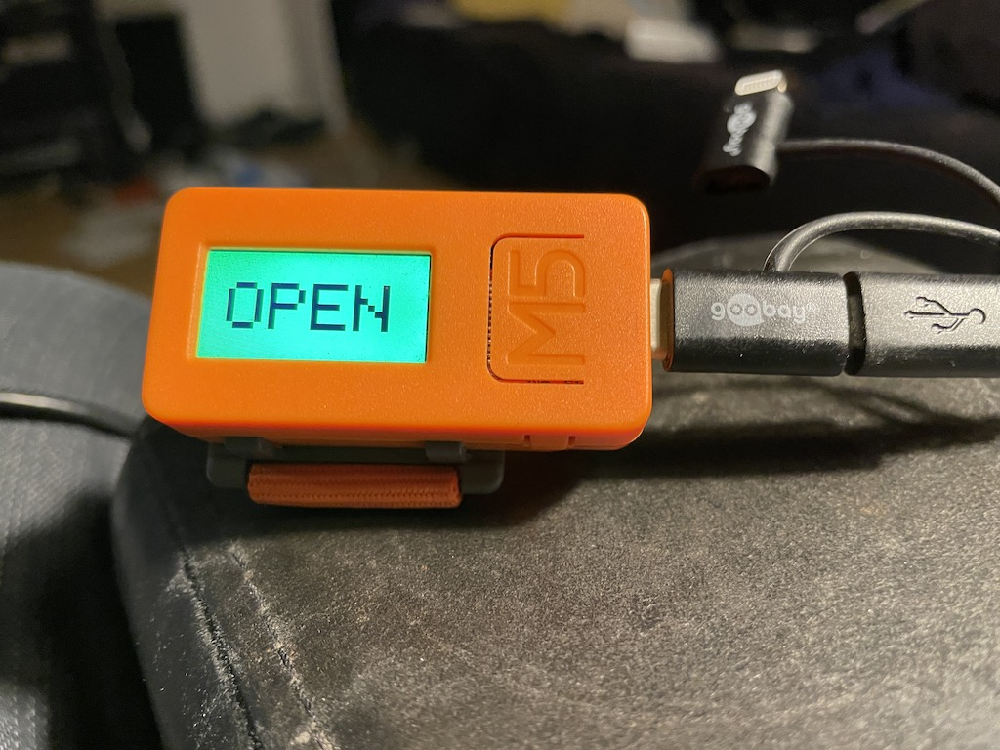

# SpaceApi switch with a Stack M5 Stick (or ESP32)

I made this project to make it easy to use the [SpaceApi](https://spaceapi.io/) and use a open/close switch in you own local hacker/maker space. In the end it got more complex then I hoped for. If you have any suggestions to make this project better or easier to implement let me know.

## What you need
- webhost to host the php and spaceapi json file
- Stack M5 Stick or similar (ESP32 with a button and LCD screen). If you use an other ESP32 product you have to change the code for the button and screen.
- A bit experience with Arduino IDE. I tried to explain the steps in detail but it could be I missed a step.

# Steps 

## Clone code
[Download](https://github.com/zeno4ever/spaceapi-ESP32-M5StickC/archive/refs/heads/main.zip) this project or clone this git.

## Generate a key
First step is to generate a 'key' that only you know and is used as an authorization. You can generate a key with you favorite password manager or a site like [random.org](https://www.random.org/strings/?num=1&len=20&digits=on&upperalpha=on&loweralpha=on&unique=on&format=html&rnd=new). Make your key long enough (20 chars or more). You will need this key in the Arduino step AND php step.

## Change the defaults

### Website PHP
We have to change 2 files for the website hosting part. 
1) Open the file '/website/config.php' and replace for the variable '$localPrivateKey' the current key for the key you generated in previous step.
2) Open the file '/website/spaceapi_json.php' and replace alle 'yourspace.com' mentions to your own name/space.

When you are done place the directory 'spaceapi' in the root of your site or subdomain. Be sure you can access the file '$yourhost/spaceapi/spaceapi_json.php' without redirect to https or other redirects.

### Arduino IDE
If you use the M5 Stick for the first time follow [these instructions](https://docs.m5stack.com/en/quick_start/m5core/arduino) to use the M5 Stick with the Arduino IDE. Check if everything works ok by selecting a example project and upload this to your Stick.

Change settings : 
- copy '/ESP32/config_example.h' to '/ESP32/config.h' and replace the key
- open sketch (M5StickC_spaceapi.ino file) and change the settings in the 'config.h' tab

If you did all the steps right you should be able to compile the sketch and upload this to the M5 Stick.

## Test
Open the json file (at $yourhost/spaceapi/spaceapi_json.php) in the browser. If you press the button on your stick the open status and lastchange should change.

In the serial monitor you can see what url are requested and if there are errors.

## Publish your spaceapi url
Check if everything is done right use the [spaceapi validator](https://spaceapi.io/validator/) to check the api. If everything is OK create a pull request for https://github.com/SpaceApi/directory and add your spaceapi url. After some technical checks the PR will be accepted and the whole world can see if someone is at your space.

After some time it should also show up on sites like [mapall.space](https://mapall.space).

## Trouble shooting
If it doesn't work look with the serial monitor if you get any errors. You could uncomment line //Serial.println(line); almost on the bottom of the sketch to see what the webserver returns (eg redirects or other unexpected errors.)

## Resources
- [M5 Stack Stick](https://docs.m5stack.com/en/quick_start/m5core/arduino) use with Arduino IDE.
- [Arduino](https://www.arduino.cc/)